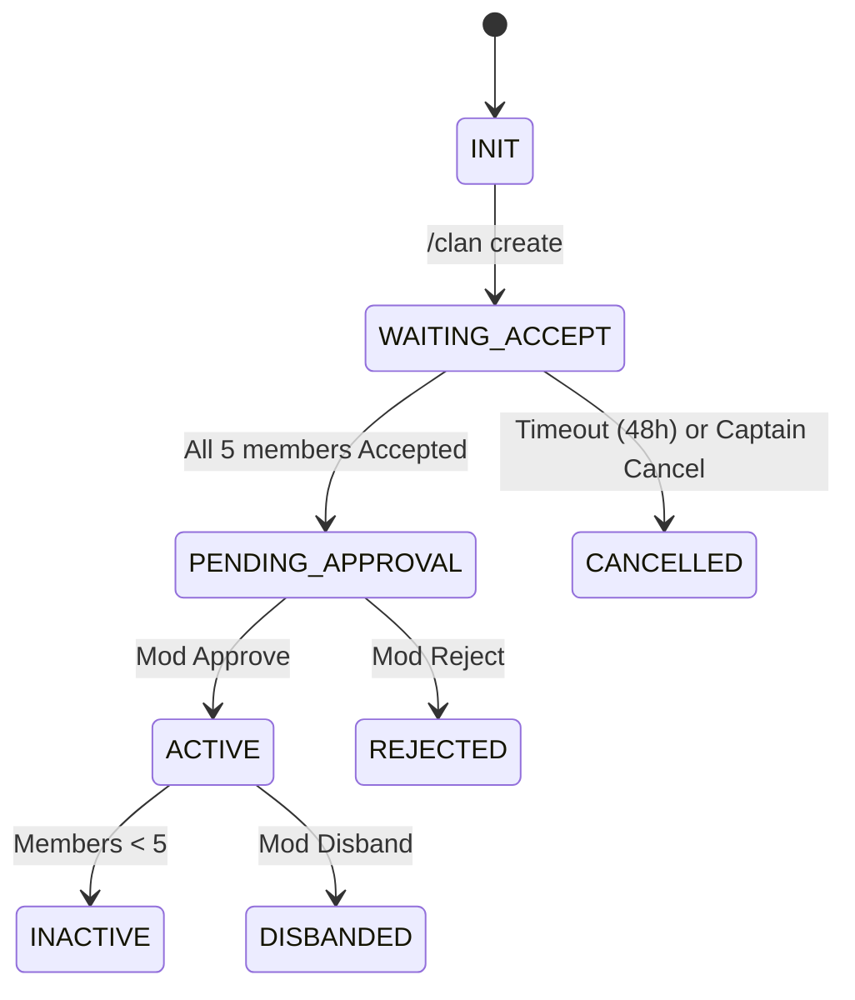
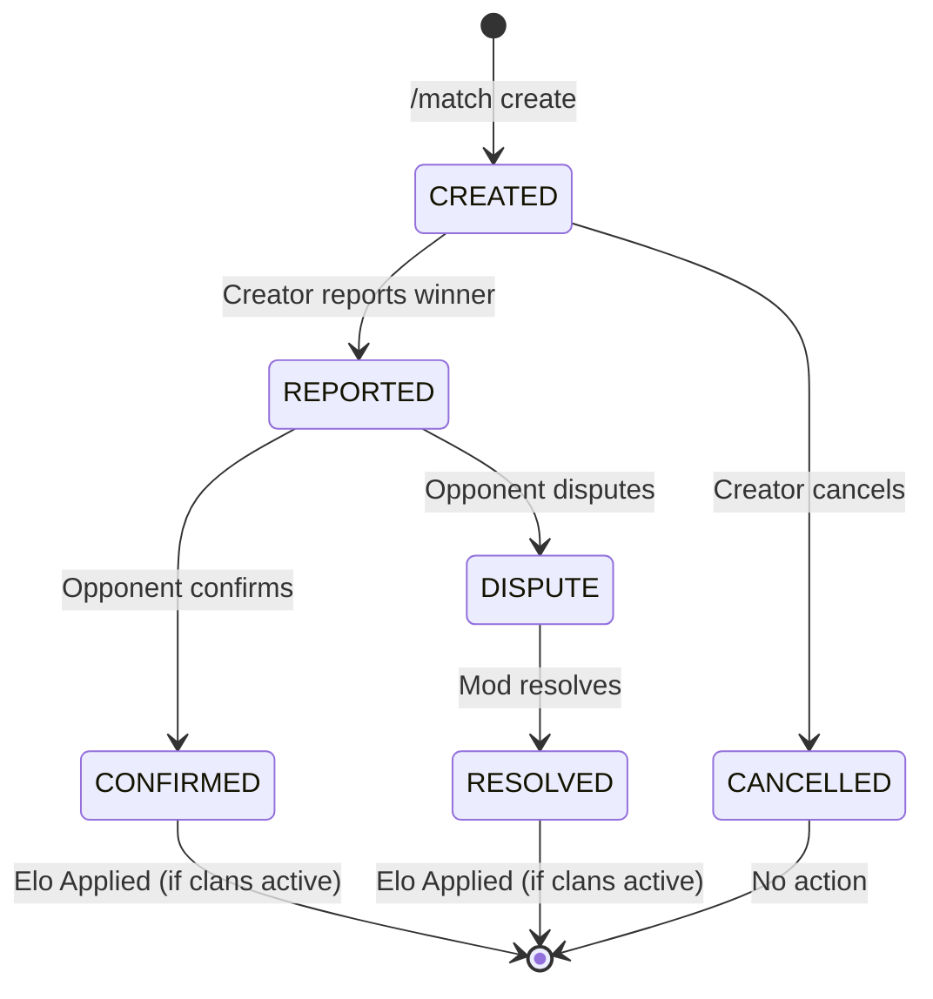
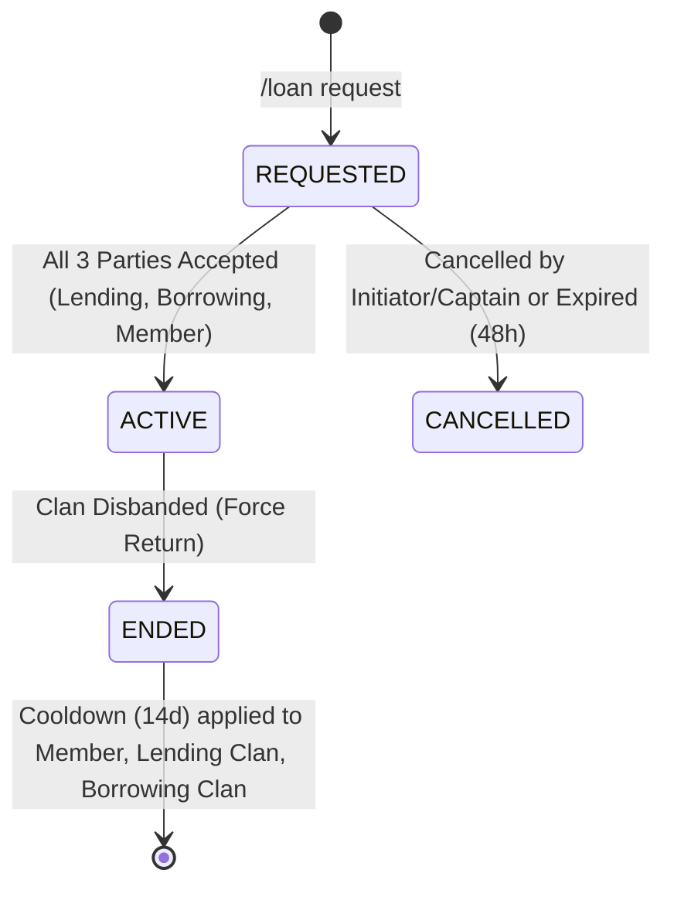
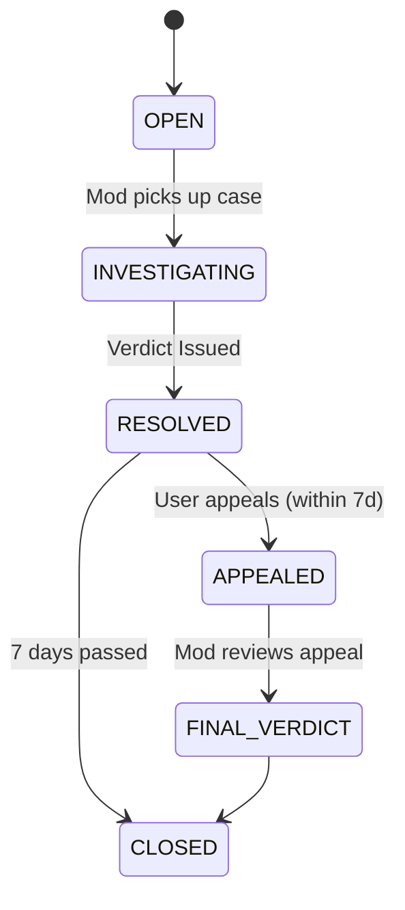
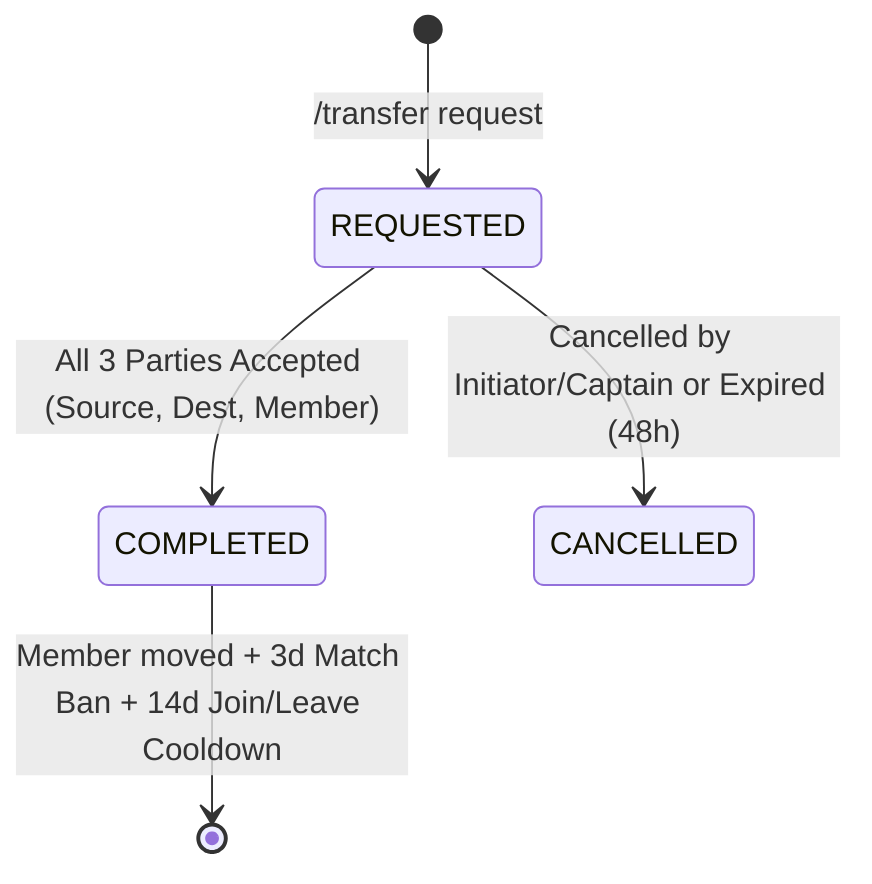

# Clan System State Machines

## 1. Clan Creation Workflow

### States
- **INIT**: Command received. Validation passed.
- **WAITING_ACCEPT**: System DMing 5 members. Waiting for all to click "Accept".
- **PENDING_APPROVAL**: All 5 accepted. Alert sent to Mod Log.
- **ACTIVE**: Clan created. Roles/Channels assigned.
- **REJECTED**: Mod denied request. Reason logged.
- **CANCELLED**: Failed to get 5 members in time.

## 2. Match Lifecycle

### States
- **CREATED**: Match created, waiting for creator to report result.
- **REPORTED**: Result reported by creator. Waiting for opponent clan member to confirm or dispute.
- **CONFIRMED**: Opponent confirmed result. Elo calculated and applied (if both clans active).
- **DISPUTE**: Opponent disputed result. Awaiting moderator resolution.
- **RESOLVED**: Mod resolved the dispute. Elo applied (if both clans active).
- **CANCELLED**: Match cancelled by creator (only before result reported).

### Permission Rules
- **Create**: Any member of a clan can create matches.
- **Report/Cancel**: Only the match creator.
- **Confirm/Dispute**: Any current member of the opponent clan.
- **Resolve**: Moderators only.

## 3. Member Loan Workflow

### States
- **REQUESTED**: Loan proposed. Waiting for 3-party acceptance (Lending Captain, Borrowing Captain, Member).
- **ACTIVE**: All parties accepted. Member temporarily in Borrowing Clan.
- **ENDED**: Loan finished. Member returns to Lending Clan. Cooldowns applied.
- **CANCELLED**: Request cancelled or expired.
- **FORCE RETURN**: Special termination logic when either involved clan disbands. Loans involving the member are cleaned up immediately to prevent data corruption.

## 4. Report & Case System

### States
- **OPEN**: Report filed.
- **INVESTIGATING**: Mod is reviewing evidence. Clan may be locked.
- **RESOLVED**: Punishment applied or dismissed.
- **APPEALED**: User used `/appeal`.
- **FINAL_VERDICT**: Appeal decision made. No further appeals.
- **CLOSED**: Case archived.

## 5. Transfer Workflow

### States
- **REQUESTED**: Transfer proposed. Waiting for 3-party acceptance (Source Captain, Dest Captain, Member).
- **COMPLETED**: All parties accepted. Member moved to Dest Clan. 
    - **Transaction Safety**: All member moves are atomic blocks in Python/SQLite to ensure they never end up in zero or two clans.
    - **Acceptance Logic**: Initiator's acceptance is automatically granted if they are a required party.
- **CANCELLED**: Request cancelled or expired.
