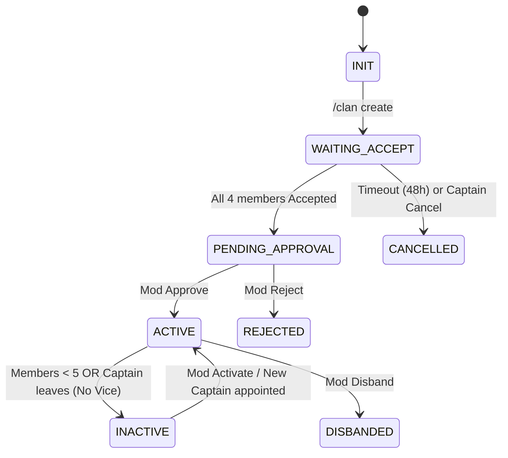
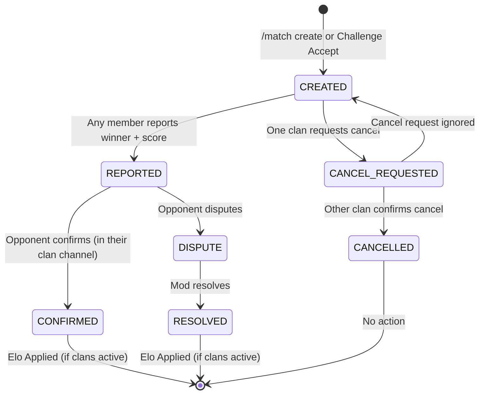
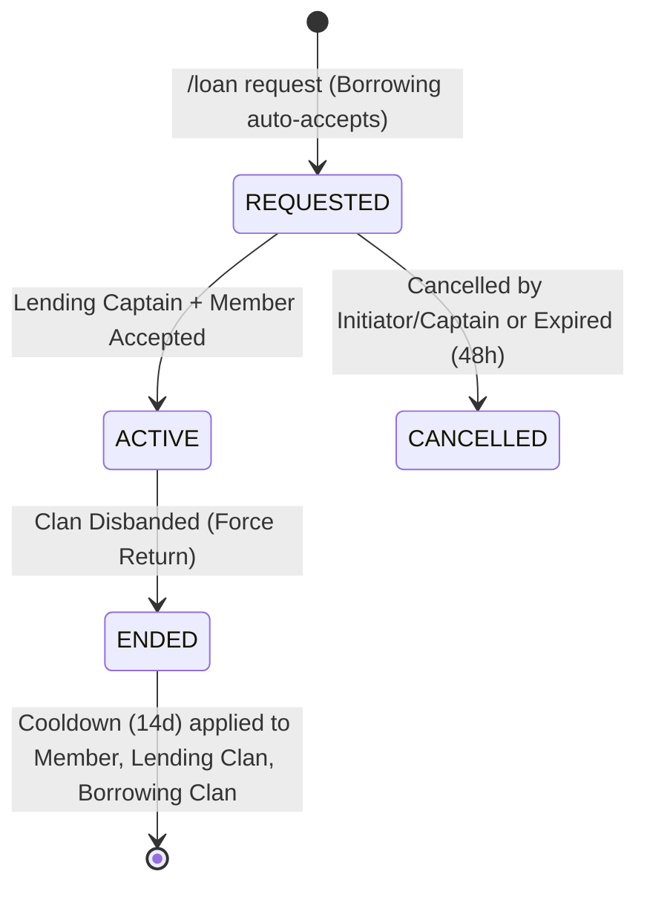
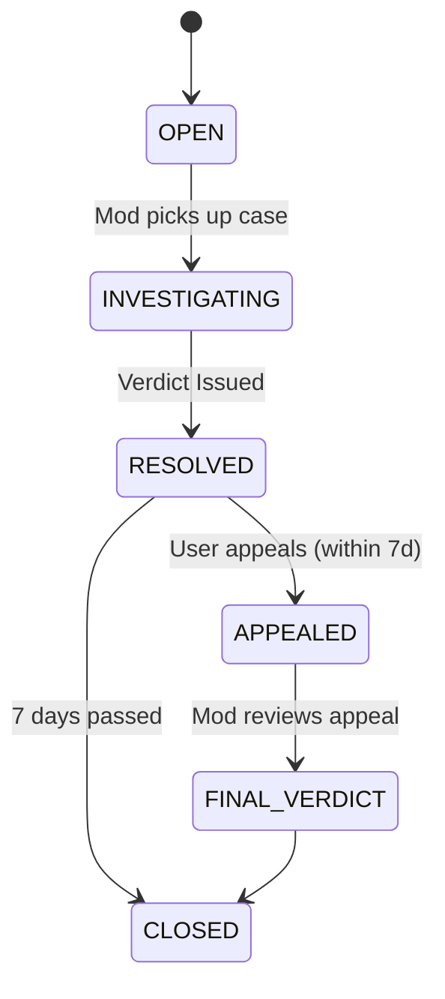
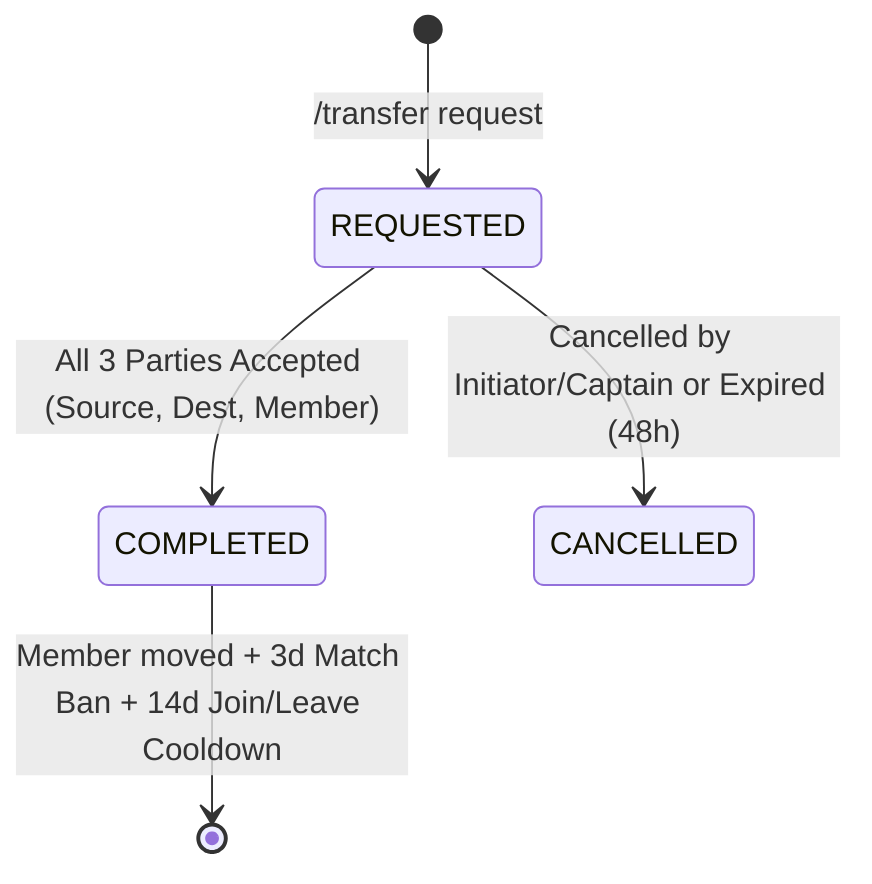
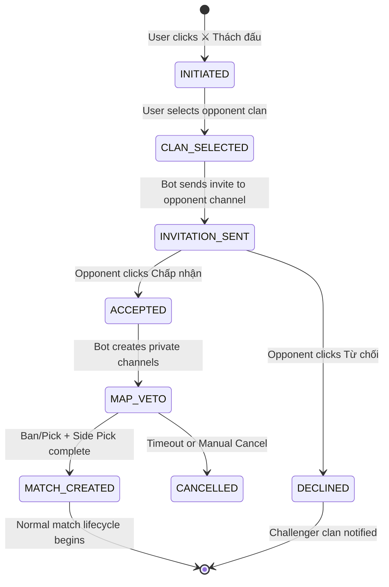

# Clan System State Machines

## 1. Clan Creation Workflow

### States
- **INIT**: Command received. Validation passed.
- **WAITING_ACCEPT**: System DMing 4 members. Waiting for all to click "Accept".
- **PENDING_APPROVAL**: All 4 accepted. Alert sent to Mod Log.
- **ACTIVE**: Clan created. Roles/Channels assigned.
- **REJECTED**: Mod denied request. Reason logged.
- **CANCELLED**: Failed to get 4 members in time.

## 2. Match Lifecycle

### States
- **CREATED**: Match created, waiting for any member of either clan to report result.
- **REPORTED**: Result reported with score (e.g. 2-1). Bot sends confirmation request to opponent clan's private channel.
- **CONFIRMED**: Opponent confirmed result. Elo calculated and applied (if both clans active).
- **DISPUTE**: Opponent disputed result. Awaiting moderator resolution.
- **RESOLVED**: Mod resolved the dispute. Elo applied (if both clans active).
- **CANCEL_REQUESTED**: One clan requested cancellation. Waiting for other clan to confirm.
- **CANCELLED**: Both clans agreed to cancel. No Elo changes.

### Permission Rules
- **Create**: Any member of a clan can create matches.
- **Report**: Any member of either participating clan.
- **Cancel**: Requires mutual agreement — one clan requests, the other confirms.
- **Confirm/Dispute**: Any current member of the opponent clan.
- **Resolve**: Moderators only.

## 3. Member Loan Workflow

### States
- **REQUESTED**: Loan proposed by Borrowing clan (auto-accepted). Waiting for 2-party acceptance (Lending Captain/Vice + Member).
- **ACTIVE**: All parties accepted. Member temporarily in Borrowing Clan.
- **ENDED**: Loan finished. Member returns to Lending Clan. Cooldowns applied.
- **CANCELLED**: Request cancelled or expired.
- **FORCE RETURN**: Special termination logic when either involved clan disbands. Loans involving the member are cleaned up immediately to prevent data corruption.

## 4. Report & Case System

### States
- **OPEN**: Report filed.
- **INVESTIGATING**: Mod is reviewing evidence. Clan may be locked.
- **RESOLVED**: Punishment applied or dismissed.
- **APPEALED**: User used `/appeal`.
- **FINAL_VERDICT**: Appeal decision made. No further appeals.
- **CLOSED**: Case archived.

## 5. Transfer Workflow

### States
- **REQUESTED**: Transfer proposed. Waiting for 3-party acceptance (Source Captain, Dest Captain, Member).
- **COMPLETED**: All parties accepted. Member moved to Dest Clan. 
    - **Transaction Safety**: All member moves are atomic blocks in Python/SQLite to ensure they never end up in zero or two clans.
    - **Acceptance Logic**: Initiator's acceptance is automatically granted if they are a required party.
- **CANCELLED**: Request cancelled or expired.

## 6. Challenge Workflow

### States
- **INITIATED**: User clicked the challenge button on Arena dashboard.
- **CLAN_SELECTED**: User chose an opponent clan from dropdown. Bot validates: clan active, not own clan, not in cooldown (10 min).
- **INVITATION_SENT**: Bot sent challenge embed with Accept/Decline buttons to opponent clan's private channel. Buttons are persistent (survive bot restart).
- **ACCEPTED**: Any member of opponent clan clicked Accept. Bot creates match in #arena and notifies both clans.
- **DECLINED**: Any member of opponent clan clicked Decline. Challenger clan is notified.
- **MATCH_CREATED**: Match follows normal Match Lifecycle (see Section 2).
